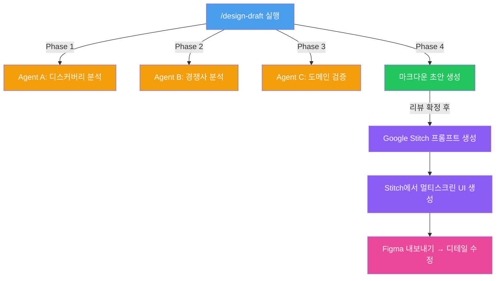
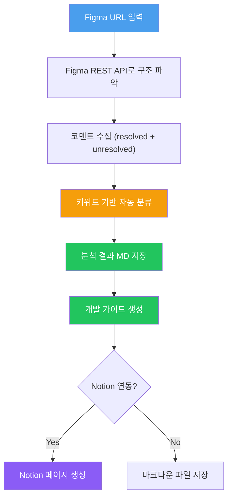

# PD 업무 자동화 키트

Claude Code를 활용한 프로덕트 디자이너용 업무 자동화 템플릿입니다.
2가지 스킬을 제공합니다:

| 스킬 | 하는 일 |
|------|--------|
| **디자인 초안 자동화** | 에픽/디스커버리 → 3-에이전트 분석 → 와이어프레임 초안 생성 |
| **핸드오프 가이드 자동화** | Figma 코멘트 분석 → 개발 가이드 자동 생성 |

---

# 1. 디자인 초안 자동화

3-에이전트 프레임워크 기반으로 와이어프레임 초안을 자동 생성합니다.

## 이 키트가 하는 일

에픽/디스커버리 문서를 넣으면 → AI가 3가지 관점(비즈니스·경쟁사·도메인)으로 분석한 뒤 → 구조화된 마크다운 초안을 자동 생성합니다.

```
인풋 (에픽/디스커버리 문서)
    ↓
Agent A: 비즈니스 컨텍스트 분석
    ↓
Agent B: 경쟁사/시장 벤치마크
    ↓
Agent C: 도메인 정책 검증
    ↓
아웃풋 (마크다운 초안 → Stitch → Figma)
```

## 빠른 시작 (5분)

### 1. 파일 복사

```
your-project/
├── .claude/
│   └── rules/
│       └── design-draft.md          ← ① 행동 규칙 (복사)
├── references/
│   ├── design-draft-template.md     ← ② 아웃풋 포맷 (복사)
│   ├── ux-checklist.md              ← ③ UX 검증 기준 (복사, 공통)
│   ├── domain-policy.md             ← ④ 도메인 정책 (직접 작성)
│   └── competitor-data.csv          ← ⑤ 경쟁사 데이터 (직접 준비)
└── outputs/                         ← 생성물 저장 폴더
```

### 2. 커스터마이징

`design-draft.md`에서 아래 3곳만 자기 프로젝트에 맞게 수정:

| 항목 | 수정 내용 | 예시 |
|------|----------|------|
| Agent B 데이터소스 | 경쟁사 분석용 데이터 경로 | `references/competitor-data.csv` |
| Agent C 참조문서 | 도메인 정책/제약 문서 경로 | `references/domain-policy.md` |
| 디자인시스템 링크 | 팀 Figma 라이브러리 URL | Figma 링크 |

### 3. 실행

Claude Code에서:
```
/design-draft [에픽 Notion URL 또는 문서 경로]
```

## 파일 설명

| 파일 | 용도 | 커스텀 필요 |
|------|------|------------|
| `rules/design-draft.md` | AI 행동 규칙 + 워크플로우 정의 | O (데이터소스 경로) |
| `references/design-draft-template.md` | 초안 아웃풋 마크다운 포맷 | △ (섹션 추가/삭제 가능) |
| `references/ux-checklist.md` | 닐슨 휴리스틱 + UX 심리학 검증 기준 | X (공통) |
| `references/domain-policy-example.md` | 도메인 정책 작성 예시 | O (자기 도메인으로 교체) |

## 3-에이전트 프레임워크

### Agent A — 디스커버리 분석
에픽/디스커버리 문서에서 추출:
- 비즈니스 목표
- 타겟 사용자 & 시나리오
- 성공 지표 (KPI)
- 데이터 분석 결과

### Agent B — 경쟁사/시장 분석
경쟁사 데이터 기반 분석:
- UX 패턴 벤치마크
- 고객 Pain Point
- 차별화 포인트

### Agent C — 도메인 정책 검증
도메인 제약조건 기반 검증:
- 비즈니스 정책 준수 여부
- 법적/규제 제약사항
- UX 체크리스트 대조

## 워크플로우 상세



## 인풋별 처리 가이드

| 인풋 | 실행되는 에이전트 | 아웃풋 |
|------|-----------------|--------|
| 에픽/디스커버리 문서 | A → B → C (전체) | 디자인 초안 마크다운 |
| 기존 Figma 화면 | B (경쟁사 대비 UX 크리틱) | 개선 리포트 |
| 경쟁사 자료만 | B → C (벤치마크 + 차별점) | 벤치마크 리포트 |

## 커스터마이징 가이드

### 에이전트 추가/수정

`design-draft.md`의 `3 에이전트 프레임워크` 섹션에서 에이전트를 추가하거나 역할을 수정할 수 있습니다.

예시 — 접근성 전문 에이전트 추가:
```markdown
- **Agent D (접근성 검증)**: WCAG 2.1 AA 기준으로 초안의 접근성 이슈를 사전 점검
```

### 도메인 정책 문서 작성

`references/domain-policy-example.md`를 참고해서 자기 도메인의 정책/제약사항을 정리하세요.

### UX 체크리스트 확장

`references/ux-checklist.md`에 팀 고유의 검증 항목을 추가할 수 있습니다.

## FAQ

**Q: Claude Code 없이도 쓸 수 있나요?**
A: `.claude/rules/` 구조는 Claude Code 전용입니다. 다른 AI 도구 사용 시 `design-draft.md` 내용을 시스템 프롬프트로 직접 전달하면 됩니다.

**Q: Google Stitch 없이도 되나요?**
A: 마크다운 초안까지는 Stitch 없이 생성 가능합니다. 이후 Figma에서 직접 와이어프레임을 그리면 됩니다.

**Q: 경쟁사 데이터가 없으면요?**
A: Agent B를 비활성화하거나, 간단한 벤치마크 URL 목록만 제공해도 동작합니다.

---

# 2. 핸드오프 가이드 자동화

Figma URL을 넣으면 → 코멘트를 자동 분류하고 → 개발팀용 가이드를 생성합니다.

```
인풋 (Figma URL + Notion URL)
    ↓
Figma REST API로 파일 구조 파악
    ↓
코멘트 수집 + 자동 분류 (정책확정/미결이슈/개발협의/QA)
    ↓
아웃풋 (Figma 분석 MD + 개발 가이드)
```

## 빠른 시작

### 1. 파일 복사

```
your-project/
├── .claude/
│   └── rules/
│       └── handoff-guide.md             ← ① 행동 규칙 (복사)
├── references/
│   ├── handoff-guide-template.md        ← ② 가이드 포맷 (복사)
│   └── figma-analysis-example.md        ← ③ 분석 결과 예시 (참고용)
└── .env                                 ← ④ FIGMA_API_TOKEN 설정
```

### 2. 커스터마이징 (필수)

`handoff-guide.md`에서 아래 항목을 팀에 맞게 수정:

| 항목 | 수정 내용 |
|------|----------|
| 코멘트 컨벤션 | 팀의 이모지/키워드 규칙 (✅, ❓ 등) |
| 분류 규칙 | 키워드 → 카테고리 매핑 |
| 핸드오프 페이지 식별 기준 | 페이지명 컨벤션 (예: 📌 이모지) |

### 3. 실행

```
Figma URL을 Claude Code에 전달하고 "핸드오프 가이드 만들어줘" 요청
```

## 파일 설명

| 파일 | 용도 | 커스텀 필요 |
|------|------|------------|
| `rules/handoff-guide.md` | AI 행동 규칙 + 코멘트 분류 규칙 | O (팀 컨벤션) |
| `references/handoff-guide-template.md` | 개발 가이드 아웃풋 포맷 | △ (섹션 추가/삭제) |
| `references/figma-analysis-example.md` | Figma 분석 결과 예시 | X (참고용) |

## 워크플로우 상세



## 알려진 한계

- 코멘트 분류는 키워드 기반 → 팀 컨벤션이 일관적일수록 정확도 상승
- Figma 어노테이션 자동 배치는 Plugin 수동 실행 필요 (REST API 쓰기 불가)
- 80% 자동 생성 + 20% 수동 보정이 현실적 목표

## 사전 준비 팁

1. **팀 코멘트 컨벤션부터 만들어라** — 자동 분류의 정확도는 팀의 코멘트 습관에 달려있다
2. **Figma API 토큰 발급** — Figma > Settings > Personal access tokens
3. **Notion MCP 연동** (선택) — 가이드를 Notion에 직접 생성하려면 필요

---

# 전체 파일 구조

```
your-project/
├── .claude/
│   └── rules/
│       ├── design-draft.md              ← 디자인 초안 행동 규칙
│       └── handoff-guide.md             ← 핸드오프 가이드 행동 규칙
├── references/
│   ├── design-draft-template.md         ← 초안 아웃풋 포맷
│   ├── ux-checklist.md                  ← UX 검증 체크리스트 (공통)
│   ├── domain-policy-example.md         ← 도메인 정책 작성 예시
│   ├── handoff-guide-template.md        ← 개발 가이드 포맷
│   └── figma-analysis-example.md        ← Figma 분석 예시
├── outputs/                             ← 생성물 저장
└── .env                                 ← API 토큰
```

---

원본: 렌트리 Conversion Squad (김예운) — 2025.04
