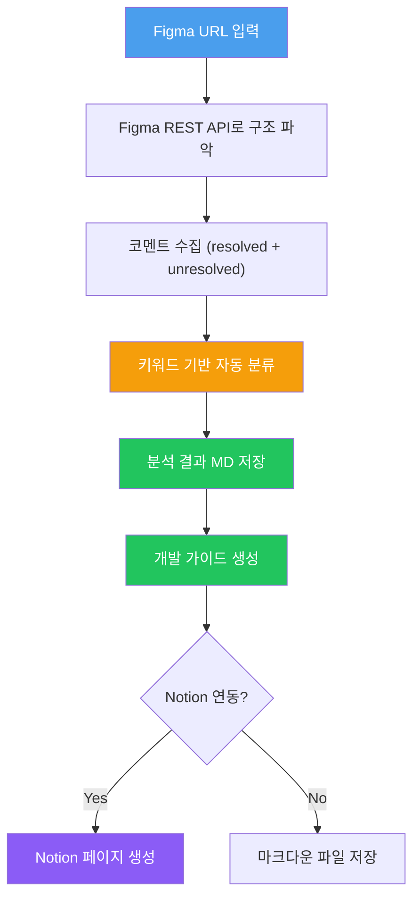

# 핸드오프 가이드 자동화

Figma 코멘트를 자동 분류하고, 개발팀용 핸드오프 가이드를 자동 생성하는 프로덕트 디자이너용 템플릿입니다.

## 이 스킬이 하는 일

Figma URL을 넣으면 → 코멘트를 자동 분류(정책확정/미결이슈/개발협의/QA)하고 → 구조화된 개발 가이드를 생성합니다.

```
인풋 (Figma URL + Notion URL)
    ↓
Figma REST API로 파일 구조 파악
    ↓
코멘트 수집 + 자동 분류 (정책확정/미결이슈/개발협의/QA)
    ↓
아웃풋 (Figma 분석 MD + 개발 가이드)
```

## 빠른 시작

### 1. 파일 복사

```
your-project/
├── .claude/
│   └── rules/
│       └── handoff-guide.md             ← ① 행동 규칙 (복사)
├── references/
│   ├── handoff-guide-template.md        ← ② 가이드 포맷 (복사)
│   └── figma-analysis-example.md        ← ③ 분석 결과 예시 (참고용)
└── .env                                 ← ④ FIGMA_API_TOKEN 설정
```

### 2. 커스터마이징 (필수)

`handoff-guide.md`에서 아래 항목을 팀에 맞게 수정:

| 항목 | 수정 내용 | 예시 |
|------|----------|------|
| 코멘트 컨벤션 | 팀의 이모지/키워드 규칙 | ✅ 확정, ❓ 미정, 🔁 변경 |
| 분류 규칙 | 키워드 → 카테고리 매핑 | "반영완료" → [정책확정] |
| 핸드오프 페이지 식별 기준 | 페이지명 컨벤션 | 📌 이모지로 시작하는 페이지 |

### 3. 실행

```
Figma URL을 Claude Code에 전달하고 "핸드오프 가이드 만들어줘" 요청
```

## 파일 설명

| 파일 | 용도 | 커스텀 필요 |
|------|------|------------|
| `rules/handoff-guide.md` | AI 행동 규칙 + 코멘트 분류 규칙 | O (팀 컨벤션) |
| `references/handoff-guide-template.md` | 개발 가이드 아웃풋 포맷 | △ (섹션 추가/삭제) |
| `references/figma-analysis-example.md` | Figma 분석 결과 예시 | X (참고용) |

## 코멘트 자동 분류

이 스킬의 핵심 기능입니다. Figma 코멘트를 키워드 기반으로 4가지 카테고리로 분류합니다.

| 카테고리 | 분류 기준 (기본값) | 용도 |
|---------|-------------------|------|
| [정책확정] | ✅, "반영완료", resolved | 확정된 정책 → 가이드에 반영 |
| [미결이슈] | ❓, "확인필요", "미정" | 미결 → 이슈 목록에 추가 |
| [개발협의] | FE/BE 관련 협의 | 개발 히스토리에 기록 |
| [QA피드백] | QA 관련 | QA 체크리스트에 반영 |

## 워크플로우 상세



## 인풋별 처리 가이드

| 인풋 | 처리 | 아웃풋 |
|------|------|--------|
| Figma URL | 구조 파악 + 코멘트 분류 + 가이드 생성 | 분석 MD + 개발 가이드 |
| Figma URL + Notion URL | 위 + 기획 컨텍스트 통합 | 풍부한 개발 가이드 |
| 기존 분석 MD | 분석 건너뛰고 가이드만 생성 | 개발 가이드 |

## 아웃풋 구조

### Figma 분석 결과 (`references/figma-analysis-{파일명}.md`)
- 파일 정보 (URL, 수정일, 코멘트 수, 작성자별 통계)
- 페이지 구조 (섹션, 프레임 계층)
- 코멘트 분류 결과 (정책확정/미결이슈/개발협의/QA피드백)

### 개발 가이드 (`references/handoff-guide-template.md` 참조)
- 프로젝트 개요 (배경, 목적, 링크)
- 기능 정의 및 정책 (기능 목록, 분기 조건)
- 화면 명세 (섹션별 화면 설명 + Figma 딥링크)
- 미결 이슈 목록
- 개발 협의 히스토리 (날짜별 결정사항)
- QA 체크리스트 (화면/케이스별 검증 항목)

## 사전 준비

1. **팀 코멘트 컨벤션부터 만들어라** — 자동 분류의 정확도는 팀의 코멘트 습관에 달려있다
2. **Figma API 토큰 발급** — Figma > Settings > Personal access tokens → `.env`에 저장
3. **Notion MCP 연동** (선택) — 가이드를 Notion에 직접 생성하려면 필요

## 알려진 한계

- 코멘트 분류는 키워드 기반 → 팀 컨벤션이 일관적일수록 정확도 상승
- 결론이 명시적이지 않은 코멘트 스레드는 놓칠 수 있음
- Figma 어노테이션 자동 배치는 Plugin 수동 실행 필요 (REST API 쓰기 불가)
- 80% 자동 생성 + 20% 수동 보정이 현실적 목표

## FAQ

**Q: Figma API 토큰은 어디서 발급하나요?**
A: Figma > Settings > Personal access tokens에서 생성. `.env` 파일에 `FIGMA_API_TOKEN=figd_...` 형태로 저장.

**Q: Notion 없이도 되나요?**
A: 네. 마크다운 파일로 가이드가 저장됩니다. Notion MCP가 연동되어 있으면 Notion 페이지도 자동 생성.

**Q: resolved 코멘트도 수집하나요?**
A: 네. resolved 코멘트는 확정 정책의 근거이므로 반드시 수집합니다.
